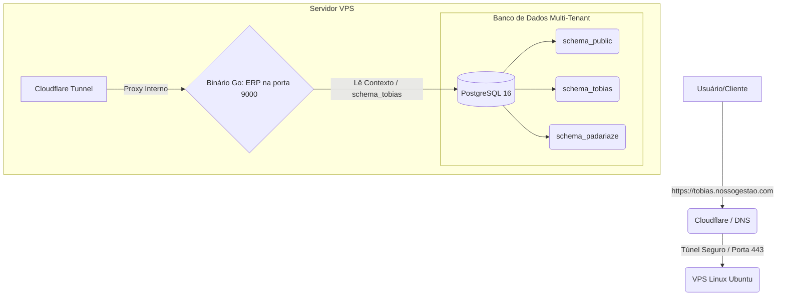

# 🚀 Guia Oficial de Hospedagem: ERP SaaS em Go

Este documento é a especificação oficial de infraestrutura e hospedagem para a aplicação SaaS em Go + PostgreSQL. Salve este documento, pois ele servirá como o seu **Manual de Operações** quando formos configurar o servidor de produção.

---

## 1. Arquitetura do Sistema (Blueprint)

---

## 2. Configurações Exigidas para a VPS (Servidor)

Para rodar essa aplicação de forma fluida, o servidor escolhido deve atender aos seguintes requisitos básicos.

- **Sistema Operacional:** `Ubuntu 24.04 LTS` (ou 22.04 LTS)
- **Processador:** `1 a 2 vCPUs`
- **Memória RAM:** `1GB a 4GB` (Recomendado 2GB+ para o PostgreSQL trabalhar bem em cache)
- **Armazenamento:** `25GB+ SSD` ou `NVMe`
- **Portas Liberadas no Firewall:** **NENHUMA** (Se usarmos Cloudflare Tunnels, apenas tráfego de saída é necessário. Caso opte por Nginx/Caddy, portas `80` e `443` devem ser abertas).

> [!TIP]
> Provedores Recomendados: **Hetzner** (Mais barato), **DigitalOcean** (Mais amigável) ou **Hostinger VPS**. Custo médio estimado: $4 a $6 dólares/mês.

---

## 3. Passo a Passo da Instalação (O que será feito)

Quando o servidor for adquirido (com o Endereço de IP e Senha de Root em mãos), estes serão os passos executados no terminal Linux:

### A. Preparação do Banco de Dados
1. Instalar o PostgreSQL 16 no Ubuntu.
2. Criar usuário seguro e banco de dados.
3. Importar a estrutura de tabelas básica usando o binário ou conectando remotamente de forma segura.

### B. Deploy da Aplicação (O Gerente Go)
1. No seu computador Windows, executaremos a compilação cruzada:
   `GOOS=linux GOARCH=amd64 go build -o gestao-api ./cmd/api`
2. Fazer o upload seguro (via `scp` ou sFTP) do arquivo `gestao-api` e do seu arquivo `.env` para o servidor Linux.
3. Criar um **Serviço Systemd** (`gestao.service`). Isso garante que a aplicação ligue sozinha se a máquina for reiniciada e permaneça rodando em background na porta 9000.

### C. Publicação e Segurança
1. Instalar o **Cloudflared** (Daemon da Cloudflare).
2. Autenticar o daemon no seu domínio (`nossogestao.com`).
3. Criar o túnel que mapeia `*.nossogestao.com` para a porta local `http://localhost:9000`.

> [!IMPORTANT]
> O uso do Cloudflare Tunnel evita completamente que hackers descubram o IP real da sua VPS. Eles só enxergarão os IPs de proteção da própria Cloudflare, e a sua aplicação Go estará totalmente invisível na internet pública.

---

## 4. Manutenção e Atualizações

Sempre que você desenvolver uma tela nova ou uma correção no seu Windows:
1. Você fará um novo build (`go build`).
2. Jogará o arquivo novo para o servidor Linux, substituindo o antigo.
3. Reiniciará o serviço (`systemctl restart gestao`).
4. **Pronto!** Seus clientes já verão a atualização instantaneamente sem perder a conexão e de forma muito leve.
